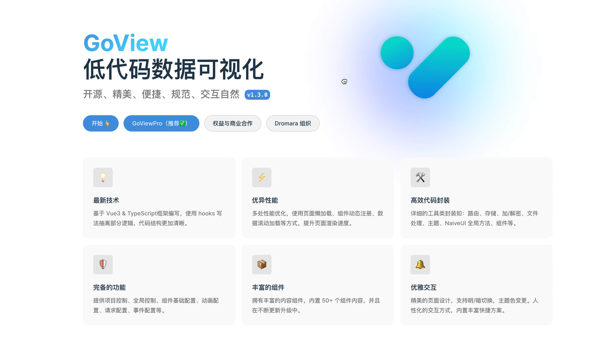

# goview-gozero

[English](README_EN.md) | 简体中文

## 一、介绍

GoView Go 后台服务。基于 [gozero](https://github.com/zeromicro/go-zero) 框架, 实现后端接口。

### GoView



[GoView](https://gitee.com/dromara/go-view/tree/master-fetch/) 是一个高效的拖拽式低代码数据可视化开发平台，将图表或页面元素封装为基础组件，无需编写代码即可制作数据大屏，减少心智负担。当然低代码也不是
“银弹”，希望所有人员都能理智看待此技术。

- 文档地址: https://www.mtruning.club/
- 演示地址: https://demo.mtruning.club/
- 前端代码 v2.2.8: [https://gitee.com/dromara/go-view/commits/v2.2.8](https://gitee.com/dromara/go-view/tree/v2.2.8)

## 二、各服务信息

### 一、接口文档

**1. Restful 接口文档**
- [swagger 接口文档](restful%2Fapi%2Frest.swagger.json)
- [接口文档.md](restful%2Fapi%2Frest.swagger.md)

**2. RPC 接口文档**
- [user-rpc.md](service%2Fuser%2Fpb%2Fdoc.md)
- [screen-rpc.md](service%2Fscreen%2Fpb%2Fdoc.md)

### 二、API 服务

| 服务名称    | 端口   | 备注 |
|---------|------|----|
| Restful | 8080 |    |

### 三、RPC 服务

| 服务名称   | 端口   | 备注       |
|--------|------|----------|
| User   | 8888 | 用户服务 RPC |
| Screen | 8899 | 大屏服务 RPC |


## 三、快速开始

### Docker运行服务
> 包含 前端 Nginx、 Restful API 服务、RPC 服务、数据库等

1. 进入 deploy 目录
    ```bash
    cd deploy
    ```
2. 执行 docker-compose up -d
    ```bash
    docker-compose up -d
    ```
    ```bash
    [+] Running 5/6
     ⠋ Network deploy_goview-gozero         Created 31.0s 
     ✔ Container goview-gozero-db           Healthy 30.7s 
     ✔ Container goview-gozero-restful-api  Started 30.9s 
     ✔ Container goview-gozero-screen-rpc   Started 30.9s 
     ✔ Container goview-gozero-web          Started 30.9s 
     ✔ Container goview-gozero-user-rpc     Started 30.8s 
    ```
3. docker container 正常运行后, 在浏览器中打开链接地址：[http://localhost/](http://localhost/)
