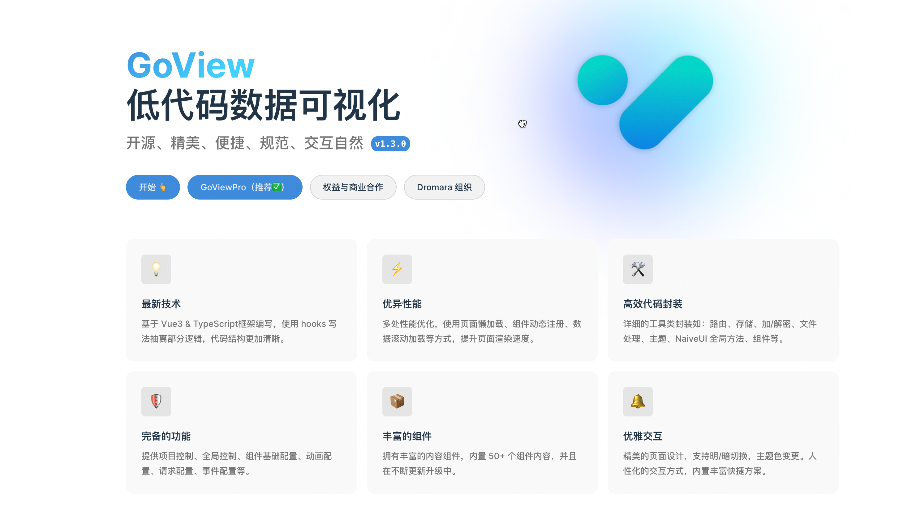

# goview-gozero
English | [简体中文](README.md)

## 1. Introduction

GoView Go backend service. Based on the [gozero](https://github.com/zeromicro/go-zero) framework, it implements backend interfaces.

### GoView



[GoView](https://gitee.com/dromara/go-view/tree/master-fetch/) is an efficient drag-and-drop low-code data visualization development platform that encapsulates charts or page elements as basic components, allowing the creation of data screens without writing code, reducing cognitive load. Of course, low-code is not a "silver bullet", and we hope everyone can treat this technology rationally.

- Documentation: https://www.mtruning.club/
- Demo: https://demo.mtruning.club/
- Frontend code v2.2.8: [https://gitee.com/dromara/go-view/commits/v2.2.8](https://gitee.com/dromara/go-view/tree/v2.2.8)

## 2. Service Information

### I. Interface Documentation

**1. Restful Interface Documentation**
- [swagger Interface Documentation](restful%2Fapi%2Frest.swagger.json)
- [Interface Documentation.md](restful%2Fapi%2Frest.swagger.md)

**2. RPC Interface Documentation**
- [user-rpc.md](service%2Fuser%2Fpb%2Fdoc.md)
- [screen-rpc.md](service%2Fscreen%2Fpb%2Fdoc.md)

### II. API Service

| Service Name | Port | Remarks |
|--------------|------|---------|
| Restful      | 8080 |         |

### III. RPC Service

| Service Name | Port | Remarks     |
|--------------|------|-------------|
| User         | 8888 | User RPC    |
| Screen       | 8899 | Screen RPC  |


## 3. Quick Start

### Run Services with Docker
> Including Frontend Nginx, Restful API Service, RPC Service, Database, etc.

1. Navigate to the deploy directory
    ```bash
    cd deploy
    ```
2. Execute docker-compose up -d
    ```bash
    docker-compose up -d
    ```
    ```bash
    [+] Running 5/6
     ⠋ Network deploy_goview-gozero         Created 31.0s 
     ✔ Container goview-gozero-db           Healthy 30.7s 
     ✔ Container goview-gozero-restful-api  Started 30.9s 
     ✔ Container goview-gozero-screen-rpc   Started 30.9s 
     ✔ Container goview-gozero-web          Started 30.9s 
     ✔ Container goview-gozero-user-rpc     Started 30.8s 
    ```
3. After the docker containers are running normally, open the link in a browser: [http://localhost/](http://localhost/)
